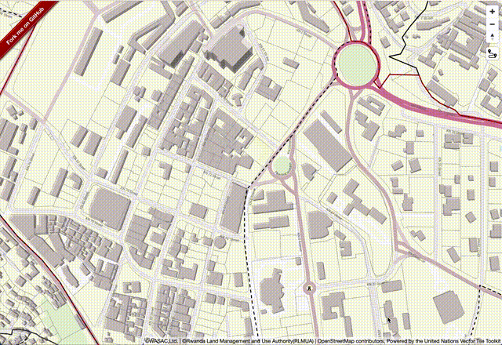

# mapbox-gl-valhalla


This module adds a control which can integrate with valhalla api.

## Installation:


```bash
npm i @watergis/mapbox-gl-valhalla --save
```

## Demo:

See [demo](https://watergis.github.io/mapbox-gl-valhalla/#12/-1.08551/35.87063).



## Usage:

```ts
import { MapboxValhallaControl} from "@watergis/mapbox-gl-valhalla";
import '@watergis/mapbox-gl-valhalla/css/styles.css';
import mapboxgl from 'mapbox-gl';

const map = new mapboxgl.Map();
map.addControl(new MapboxValhallaControl(
  'http://localhost:8002',
  {
    Contours: [
      {
        time: 3,
        distance: 1,
        color: 'ff0000',
      },
      {
        time: 5,
        distance: 2,
        color: 'ffff00',
      },
      {
        time: 10,
        distance: 3,
        color: '0000ff',
      },
    ]
  }
), 'top-right');
```

### Options
You can specify default option as follows.

- URL
  - Please specify your URL for valhalla services. eg. `http://localhost:8002`
- Contours
  - See the specification of valhalla isochrone API [here](https://valhalla.readthedocs.io/en/latest/api/isochrone/api-reference/#inputs-of-the-isochrone-service).
  - A JSON array of contour objects with the time in minutes in kilometers and color to use for each isochrone contour. You can specify up to four contours.
  - default is as follows:
```js
[
  {
    time: 5,
    distance: 1,
    color: 'ff0000',
  },
  {
    time: 10,
    distance: 2,
    color: 'ffff00',
  },
  {
    time: 15,
    distance: 3,
    color: '0000ff',
  },
]
```

## Development:

```
yarn run lint # check styling of source code
yarn run lint:fix # fix styling by eslint
yarn run dev
```

open [http://localhost:8080](http://localhost:8080).

If there are any changes on source code, it will be reflected automatically.

## Build package:

```
yarn run build
```

The modules will be generated under `dist` folder.

## Deploy to Github pages

```
yarn run deploy
```

It will deploy files under `example` folder to gh-pages.

## How to release

```zsh
vi package.json
# update version in package.json
git add package.json
git commit -m "v1.X.X"
git push origin main
git tag v1.X.X main
git push --tag
# release CI will create draft release in Github pages, then publish it if it is ready.
# publish CI will deploy npmjs and Github Packages.
```

## Contribution

This Mapbox GL Valhalla plugin is still under development. so most welcome any feedbacks and pull request to this repository.
